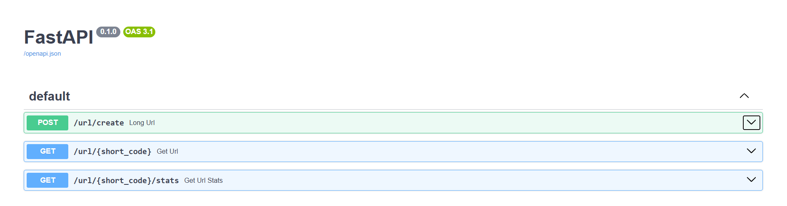

# 🔗 URL Shortener API

A simple URL shortener built with **FastAPI**, **SQLAlchemy** and **PostgreSQL**. Turn long URLs into short codes (or pick your own custom code), redirect visitors, and track how many times each link was clicked.



## Features

- **Shorten URLs:** each long URL gets a random 6-character alphanumeric code
- **Custom codes:** optionally choose your own code (up to 10 characters)
- **Redirects:** visiting a short link sends you to the original URL
- **Click tracking:** every redirect increments a click counter
- **Link expiry:** short links expire automatically after **7 days**
- **Stats endpoint:** look up details for any short code
- **Database migrations** managed with Alembic

## Tech Stack

| Layer          | Tool                          |
| -------------- | ----------------------------- |
| Framework      | FastAPI                       |
| ORM            | SQLAlchemy 2.x                |
| Database       | PostgreSQL (`psycopg2`)       |
| Migrations     | Alembic                       |
| Config         | pydantic-settings (`.env`)    |
| Python         | 3.13+                         |
| Package manager| [uv](https://docs.astral.sh/uv/) (pip also works) |

## Project Structure

```
URL_Shortner/
├── alembic/             # Migration scripts
│   └── versions/
├── docs/
│   └── image.png        # Swagger UI screenshot
├── models/
│   └── url.py           # SQLAlchemy Url model
├── routers/
│   └── url.py           # API endpoints
├── schemas/
│   └── url.py           # Pydantic request/response schemas
├── utils/
│   └── short_code.py    # Unique short-code generator
├── database.py          # Engine, session and get_db dependency
├── settings.py          # Environment settings
├── main.py              # FastAPI app entry point
├── pyproject.toml
└── requirements.txt
```

## Getting Started

### 1. Clone the repository

```bash
git clone <your-repo-url>
cd URL_Shortner
```

### 2. Install dependencies

With **uv**:

```bash
uv sync
```

Or with **pip**:

```bash
python -m venv .venv
# Windows
.venv\Scripts\activate
# macOS / Linux
source .venv/bin/activate

pip install -r requirements.txt
```

### 3. Create a PostgreSQL database

```sql
CREATE DATABASE url_short;
```

### 4. Configure environment variables

Create a `.env` file in the project root:

```env
DB_CONNECTION="postgresql://<user>:<password>@localhost:5432/url_short"
SECRET_KEY="your-secret-key"
ALGORITHM="HS256"
```

### 5. Configure Alembic

`alembic.ini` is git-ignored because it contains your database credentials. Generate one and point it at your database:

```bash
alembic init alembic_tmp   # only to get a fresh alembic.ini, then delete the alembic_tmp folder
```

In `alembic.ini`, set:

```ini
script_location = alembic
sqlalchemy.url = postgresql://<user>:<password>@localhost:5432/url_short
```

> **Note:** if your password contains `%` or `$`, escape `%` as `%%` in `alembic.ini`.

### 6. Run migrations

```bash
alembic upgrade head
```

### 7. Start the server

```bash
fastapi dev main.py
# or
uvicorn main:app --reload
```

The API runs at **http://localhost:8000**.

- Swagger UI: http://localhost:8000/docs
- ReDoc: http://localhost:8000/redoc

## API Reference

| Method | Endpoint                    | Description                                      |
| ------ | --------------------------- | ------------------------------------------------ |
| `POST` | `/url/create`               | Create a short URL (optionally with custom code) |
| `GET`  | `/url/{short_code}`         | Redirect to the original URL                     |
| `GET`  | `/url/{short_code}/stats`   | Get details for a short URL                      |

### `POST /url/create`

**Request body**

```json
{
  "original_url": "https://www.example.com/some/very/long/path",
  "custom_code": "mylink"
}
```

`custom_code` is optional (max 10 characters).

**Response (200)**

```json
{
  "message": "short url created",
  "short_code": "aB3xK9",
  "short_url": "localhost:8000/url/aB3xK9"
}
```

When a `custom_code` is given, the response also includes it and `short_url` uses the custom code:

```json
{
  "message": "short url created",
  "short_code": "aB3xK9",
  "custom_code": "mylink",
  "short_url": "localhost:8000/url/mylink"
}
```

**Errors**

- `400 Bad Request`: the custom code is already taken

### `GET /url/{short_code}`

Redirects (`307`) to the original URL and increments the click count. Works with both the generated short code and a custom code.

**Errors**

- `404 Not Found`: short code doesn't exist, or the link has expired

### `GET /url/{short_code}/stats`

**Response (200)**

```json
{
  "original_url": "https://www.example.com/some/very/long/path",
  "short_url": "localhost:8000/url/aB3xK9",
  "short_code": "aB3xK9",
  "custom_code": "mylink",
  "created_at": "2026-09-27T04:30:00",
  "expires_at": "2026-10-04T04:30:00"
}
```

**Errors**

- `404 Not Found`: short code doesn't exist

## Example with cURL

```bash
# Create a short URL
curl -X POST http://localhost:8000/url/create \
  -H "Content-Type: application/json" \
  -d '{"original_url": "https://fastapi.tiangolo.com"}'

# Follow the redirect
curl -L http://localhost:8000/url/aB3xK9

# View stats
curl http://localhost:8000/url/aB3xK9/stats
```

## Database Schema

Table: `url`

| Column         | Type     | Notes                         |
| -------------- | -------- | ----------------------------- |
| `id`           | Integer  | Primary key                   |
| `original_url` | String   | Required                      |
| `short_code`   | String   | Unique, 6 characters          |
| `short_url`    | String   | Unique                        |
| `custom_code`  | String   | Optional                      |
| `created_at`   | DateTime | Defaults to current UTC time  |
| `expires_at`   | DateTime | `created_at` + 7 days         |
| `click_count`  | Integer  | Defaults to 0                 |

